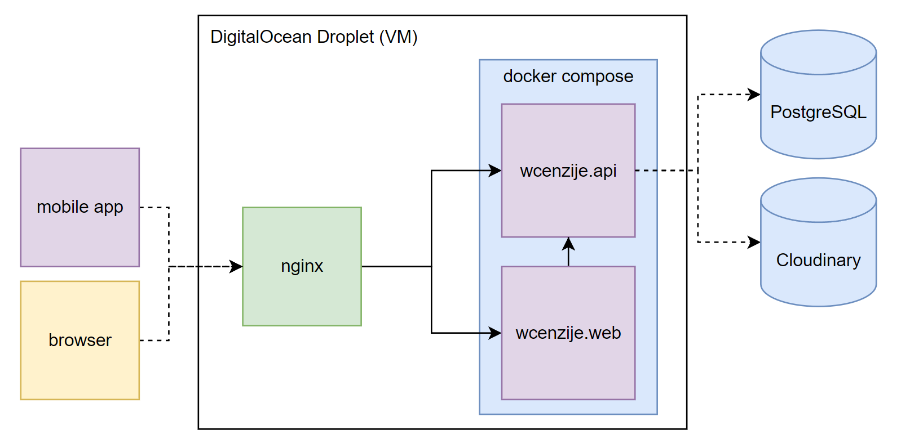

# WCenzije

A public toilet reviewing app.

https://wcenzije.com

Published on [Google Play](https://play.google.com/store/apps/details?id=com.kova98.wcenzije). 

## Features
- Web Landing Page
- Web Admin Interface
   - Basic auth
   - View and delete reviews
- Mobile App
   - Basic auth
   - View all reviews on a map
   - View all reviews for specific location
   - View review details
   - Add reviews with or without images
   - View all the reviews you posted
   
## Tech Stack
**Mobile:** Flutter  
**Backend:** .NET 8  
**Web Frontend:** NextJS, Tailwind  
**Persistence:** PostgreSQL, Cloudinary  
**Infrastructure:** DigitalOcean, Nginx, Docker, Docker Compose  
**CI/CD:** GitHub Actions  

## Production Architecture

